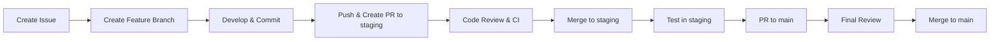

# Contributing to Insurance AI Bridge

Thank you for your interest in contributing to the Insurance AI Bridge project!

## Development Setup

1. **Clone the repository**
   ```bash
   git clone <repository-url>
   cd insurance-ai-bridge
   ```

2. **Set up backend**
   ```bash
   cd backend
   python -m venv venv
   source venv/bin/activate  # On Windows: venv\Scripts\activate
   pip install -r requirements.txt
   pip install -r requirements-dev.txt
   ```

3. **Set up frontend**
   ```bash
   cd frontend
   npm install
   ```

4. **Configure environment**
   ```bash
   cp .env.example .env
   # Edit .env with your configuration
   ```

## Development Workflow

We use **GitHub Flow** with feature branches, a `staging` branch for testing, and `main` for production.

### Workflow Overview



### Complete Workflow Process

1. **Create GitHub Issue**
   - Get an issue number (e.g., #123)
   - Use the issue templates provided in `.github/ISSUE_TEMPLATE/`

2. **Create Feature Branch**
   ```bash
   # Using helper script (recommended)
   ./scripts/create_feature_branch.sh ISSUE-123 add-user-authentication
   
   # Or manually
   git checkout -b feature/ISSUE-123-add-user-authentication staging
   ```

3. **Make Your Changes**
   - Write code following the project's style guide
   - Add tests for new features
   - Update documentation as needed
   - Follow commit message format (see below)

4. **Test Your Changes Locally**
   ```bash
   # Backend tests
   cd backend
   pytest
   
   # Frontend tests
   cd frontend
   npm test
   npm run build
   ```

5. **Commit Your Changes**
   ```bash
   git add .
   git commit -m "[COMPONENT] Action: Description (Closes #123)"
   ```
   
   The commit-msg hook will validate your commit message format.

6. **Sync with Staging (if needed)**
   ```bash
   # Keep your branch up to date with staging
   ./scripts/sync_branch.sh staging rebase
   ```

7. **Prepare for PR**
   ```bash
   # Run pre-PR checks
   ./scripts/prepare_pr.sh
   ```

8. **Push and Create PR to Staging**
   ```bash
   git push -u origin feature/ISSUE-123-add-user-authentication
   ```
   - Create PR to `staging` branch using GitHub UI
   - Fill out the PR template
   - Wait for CI checks to pass
   - Request at least 1 review

9. **Code Review & Merge to Staging**
   - Address review comments
   - Ensure all CI checks pass
   - Get approval
   - Merge to `staging`

10. **Test in Staging Environment**
    - Deploy to staging (automated or manual)
    - Perform manual testing
    - Run E2E tests

11. **Create PR to Main**
    - After staging tests pass, create PR from `staging` to `main`
    - Fill out PR template
    - Require at least 2 approvals (if configured)
    - Final review and merge to `main`

12. **Deploy to Production**
    - Merge triggers production deployment (if configured)
    - Monitor deployment and post-deployment checks

### Branch Naming Convention

Follow this naming pattern: `<type>/<ISSUE-NUMBER>-<description>`

**Types:**
- `feature/` - New features
- `bugfix/` - Bug fixes
- `hotfix/` - Critical production fixes (merge to `main` directly)
- `docs/` - Documentation changes
- `refactor/` - Code refactoring

**Examples:**
```bash
feature/ISSUE-123-add-user-authentication
bugfix/ISSUE-456-fix-login-error
hotfix/ISSUE-789-security-patch
docs/ISSUE-101-update-readme
refactor/ISSUE-202-optimize-database
```

### Commit Message Format

Follow this format: `[COMPONENT] Action: Description (Issue Reference)`

**Format Breakdown:**
- `[COMPONENT]` - Component affected (required)
- `Action:` - Action verb (required, followed by colon)
- `Description` - Clear description (required)
- `(Issue Reference)` - Optional issue reference

**Components:**
- `[BACKEND]` - Backend application code
- `[FRONTEND]` - Frontend React components
- `[API]` - API endpoints and routes
- `[LLM]` - LLM integration
- `[SECURITY]` - Security features
- `[TEST]` - Test code
- `[DOCS]` - Documentation
- `[FIX]` - Bug fixes
- `[DEPLOY]` - Deployment configuration
- `[REFACTOR]` - Code refactoring
- `[CHORE]` - Maintenance tasks

**Issue References:**
- `(Closes #123)` - Closes the issue
- `(Fixes #456)` - Fixes the issue
- `(Related to #789)` - Related to the issue

**Examples:**
```bash
[BACKEND] Add user authentication endpoint (Closes #123)
[FRONTEND] Create claim search component (Fixes #456)
[API] Implement rate limiting middleware
[TEST] Add integration tests for PII handler (Related to #789)
[FIX] Resolve token refresh race condition (Fixes #101)
[DOCS] Update API documentation (Closes #202)
```

**Best Practices:**
- Keep first line under 72 characters
- Use present tense ("Add" not "Added")
- Be specific and descriptive
- Reference issues when applicable
- Add detailed explanation in commit body if needed

### Rebase vs Merge Strategy

**For Feature Branches:**
- Use **rebase** when syncing with `staging` or `main` before merging
- This keeps a linear history
- Use: `./scripts/sync_branch.sh staging rebase`

**For Hotfixes:**
- Use **merge** if you need to preserve exact commit history
- Generally prefer rebase for cleaner history

### Testing Requirements Before PR

Before creating a PR, ensure:

- [ ] All existing tests pass
- [ ] New tests added for new functionality
- [ ] Manual testing completed
- [ ] Code follows style guidelines
- [ ] Documentation updated (if applicable)
- [ ] No merge conflicts
- [ ] Branch is up to date with target branch

Run the preparation script to verify:
```bash
./scripts/prepare_pr.sh
```

### Pull Request Guidelines

1. **Use the appropriate PR template:**
   - `.github/PULL_REQUEST_TEMPLATE/feature.md` for features
   - `.github/PULL_REQUEST_TEMPLATE/bugfix.md` for bug fixes
   - `.github/PULL_REQUEST_TEMPLATE/hotfix.md` for hotfixes

2. **Fill out all sections of the PR template**

3. **Link related issues** using keywords (Closes, Fixes, Related to)

4. **Ensure CI checks pass** before requesting review

5. **Keep PRs focused** - one feature/fix per PR

6. **Keep PRs small** - easier to review and test

7. **Add screenshots/recordings** for UI changes

8. **Request appropriate reviewers** based on code changed

## Code Style

### Python (Backend)
- Follow PEP 8 style guide
- Use type hints for all functions
- Maximum line length: 100 characters
- Use Black for code formatting: `black .`
- Use mypy for type checking: `mypy app/`
- Use ruff for linting: `ruff check .`

### TypeScript (Frontend)
- Use TypeScript strict mode
- Follow ESLint rules
- Use Prettier for formatting
- Maximum line length: 100 characters
- Prefer functional components with hooks

## Testing

### Backend Tests
```bash
cd backend
pytest                    # Run all tests
pytest tests/test_pii_handler.py -v  # Run specific test file
pytest --cov=app         # Run with coverage
```

### Frontend Tests
```bash
cd frontend
npm test                  # Run unit tests
npm run test:e2e         # Run E2E tests
npm run build            # Test build
```

## Security Guidelines

- **Never commit secrets** - Use environment variables
- **Never log PII** - All PII must be masked
- **Use parameterized queries** - Prevent SQL injection
- **Validate all inputs** - Use Pydantic schemas
- **Rate limit endpoints** - Prevent abuse
- **Follow HIPAA guidelines** - Maintain compliance

## Documentation

- Update README.md for major changes
- Add docstrings to all functions
- Update API documentation for endpoint changes
- Keep architecture diagrams current

## Git Hooks Setup

We use Git hooks to enforce code quality and commit message format. Install them with:

```bash
chmod +x scripts/setup_git_hooks.sh
./scripts/setup_git_hooks.sh
```

**Hooks installed:**
- `pre-commit` - Runs linting and checks before commit
- `pre-push` - Runs tests before push (optional)
- `commit-msg` - Validates commit message format

## Helper Scripts

We provide several helper scripts to streamline the workflow:

### Create Feature Branch
```bash
./scripts/create_feature_branch.sh ISSUE-123 add-user-authentication [type]
```
Creates a properly named feature branch from the current branch (default: staging).

### Sync Branch
```bash
./scripts/sync_branch.sh [target-branch] [strategy]
```
Syncs your feature branch with `staging` or `main`. Strategy can be `rebase` (default) or `merge`.

### Prepare PR
```bash
./scripts/prepare_pr.sh
```
Runs pre-PR checks, tests, and validates your branch before creating a PR.

### Setup Git Workflow
```bash
./scripts/setup_git_workflow.sh
```
Creates the `staging` branch and verifies workflow setup.

### Setup Git Hooks
```bash
./scripts/setup_git_hooks.sh
```
Installs git hooks for code quality enforcement.

## Branch Protection

**Protected Branches:**
- `main` - Production branch (2 approvals required, all checks must pass)
- `staging` - Testing branch (1 approval required, all checks must pass)

**Direct pushes to protected branches are not allowed.** All changes must go through Pull Requests.

See [`.github/BRANCH_PROTECTION_SETUP.md`](.github/BRANCH_PROTECTION_SETUP.md) for detailed branch protection setup instructions.

## Additional Resources

- [Git Workflow Documentation](docs/git-workflow.md) - Comprehensive Git workflow guide
- [Branch Protection Setup](.github/BRANCH_PROTECTION_SETUP.md) - Branch protection configuration guide
- [API Reference](docs/api-reference.md) - API documentation
- [Architecture Documentation](docs/architecture.md) - System architecture

## Questions?

For questions or concerns:
- Open an issue on GitHub using the issue templates
- Check the documentation in `docs/`
- Review the Git workflow guide: `docs/git-workflow.md`

