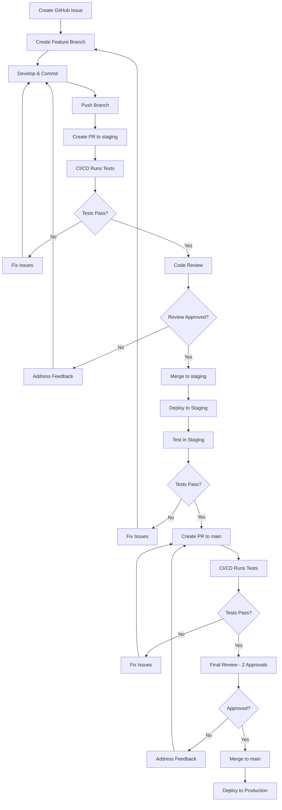

# Git Workflow Guide

This document provides a comprehensive guide to the Git workflow used in the Insurance AI Bridge project.

## Table of Contents

- [Overview](#overview)
- [Workflow Diagram](#workflow-diagram)
- [Branch Strategy](#branch-strategy)
- [Branch Naming Convention](#branch-naming-convention)
- [Complete Workflow Process](#complete-workflow-process)
- [Commit Message Format](#commit-message-format)
- [Pull Request Process](#pull-request-process)
- [Code Review Guidelines](#code-review-guidelines)
- [Testing Requirements](#testing-requirements)
- [Git Hooks](#git-hooks)
- [Helper Scripts](#helper-scripts)
- [Branch Protection](#branch-protection)
- [Troubleshooting](#troubleshooting)

## Overview

We use **GitHub Flow** with a `staging` branch for testing before production deployment. The workflow ensures code quality, thorough testing, and proper code review before changes reach production.

### Key Principles

1. **Feature branches** - All work is done in feature branches
2. **Staging environment** - All features are tested in staging before production
3. **Pull requests** - All changes go through PRs with code review
4. **Branch protection** - Protected branches prevent direct pushes
5. **Automated testing** - CI/CD runs tests on every PR
6. **Code quality** - Git hooks enforce commit message format and code style

## Workflow Diagram



## Branch Strategy

### Main Branches

1. **`main`** - Production branch
   - Always deployable
   - Protected (requires PR, 2 approvals, all checks must pass)
   - Only merged from `staging`
   - Tagged with version numbers

2. **`staging`** - Testing branch
   - Pre-production testing environment
   - Protected (requires PR, 1 approval, all checks must pass)
   - Merged from feature branches
   - Merges to `main` after testing

### Feature Branches

- **`feature/`** - New features
- **`bugfix/`** - Bug fixes
- **`hotfix/`** - Critical production fixes (can merge directly to `main`)
- **`docs/`** - Documentation changes
- **`refactor/`** - Code refactoring

All feature branches are created from `staging` (or `main` for hotfixes) and merge back to `staging`.

## Branch Naming Convention

Follow this format: `<type>/<ISSUE-NUMBER>-<description>`

### Format Breakdown

- **Type:** `feature`, `bugfix`, `hotfix`, `docs`, `refactor`
- **Issue Number:** GitHub issue number (e.g., `ISSUE-123`)
- **Description:** Short, kebab-case description (e.g., `add-user-authentication`)

### Examples

```bash
feature/ISSUE-123-add-user-authentication
bugfix/ISSUE-456-fix-login-error
hotfix/ISSUE-789-security-patch
docs/ISSUE-101-update-readme
refactor/ISSUE-202-optimize-database
```

### Rules

- Use lowercase for descriptions
- Use hyphens to separate words
- Keep descriptions concise (3-5 words)
- Include issue number for traceability
- Be descriptive but brief

## Complete Workflow Process

### 1. Create Issue

First, create a GitHub issue describing the work to be done:

1. Go to GitHub repository
2. Click "New Issue"
3. Choose appropriate template:
   - Feature Request
   - Bug Report
4. Fill out the template
5. Get issue number (e.g., #123)

### 2. Create Feature Branch

Using the helper script (recommended):

```bash
./scripts/create_feature_branch.sh ISSUE-123 add-user-authentication
```

Or manually:

```bash
# Ensure you're on staging and up to date
git checkout staging
git pull origin staging

# Create feature branch
git checkout -b feature/ISSUE-123-add-user-authentication
```

### 3. Develop and Commit

Make your changes following the coding standards:

```bash
# Make changes to files
# ...

# Stage changes
git add .

# Commit with proper format
git commit -m "[BACKEND] Add user authentication endpoint (Closes #123)"

# Continue making commits as needed
git commit -m "[TEST] Add authentication tests (Related to #123)"
```

**Commit Message Format:** `[COMPONENT] Action: Description (Issue Reference)`

See [Commit Message Format](#commit-message-format) section for details.

### 4. Keep Branch Updated

Sync with staging regularly to avoid conflicts:

```bash
# Using helper script
./scripts/sync_branch.sh staging rebase

# Or manually
git fetch origin
git rebase origin/staging
```

### 5. Test Locally

Before creating a PR, run all tests:

```bash
# Backend tests
cd backend
pytest

# Frontend tests
cd frontend
npm test
npm run build
```

### 6. Prepare for PR

Use the helper script to prepare your branch:

```bash
./scripts/prepare_pr.sh
```

This will:
- Check for uncommitted changes
- Sync with staging
- Run tests
- Validate commit messages
- Show summary

### 7. Push Branch

Push your branch to remote:

```bash
git push -u origin feature/ISSUE-123-add-user-authentication
```

### 8. Create PR to Staging

1. Go to GitHub repository
2. Click "New Pull Request"
3. Select base branch: `staging`
4. Select compare branch: `feature/ISSUE-123-add-user-authentication`
5. Fill out PR template:
   - Use `.github/PULL_REQUEST_TEMPLATE/feature.md` for features
   - Use `.github/PULL_REQUEST_TEMPLATE/bugfix.md` for bug fixes
6. Link related issues using keywords (Closes #123, Fixes #456)
7. Request reviewers
8. Assign labels (if applicable)
9. Create PR

### 9. CI/CD Checks

GitHub Actions will automatically:
- Run backend tests
- Run frontend tests
- Build Docker images
- Run linting and type checking
- Post test results as PR comment

**All checks must pass before merge!**

### 10. Code Review

- Address review comments
- Make requested changes
- Push updates to your branch
- Request re-review if needed

### 11. Merge to Staging

Once approved and all checks pass:
- Merge the PR to `staging`
- Delete the feature branch (optional, can be done automatically)

### 12. Test in Staging

After merge to `staging`:
- Staging environment is deployed (if automated)
- Perform manual testing
- Run E2E tests (if applicable)
- Verify integration with other features

### 13. Create PR to Main

After staging tests pass:

1. Go to GitHub repository
2. Click "New Pull Request"
3. Select base branch: `main`
4. Select compare branch: `staging`
5. Fill out PR template
6. Summarize changes from staging
7. List staging test results
8. Request final reviews (at least 2 required)

### 14. Final Review and Merge to Main

- Get at least 2 approvals (for `main` branch)
- Ensure all CI checks pass
- Merge PR to `main`
- Production deployment triggers (if automated)

### 15. Production Deployment

After merge to `main`:
- Production deployment triggers
- Monitor deployment
- Verify production functionality
- Monitor for issues

## Commit Message Format

### Format

```
[COMPONENT] Action: Description (Issue Reference)

Optional body with detailed explanation...
```

### Components

- `[BACKEND]` - Backend application code
- `[FRONTEND]` - Frontend React components
- `[API]` - API endpoints and routes
- `[LLM]` - LLM integration
- `[SECURITY]` - Security features
- `[TEST]` - Test code
- `[DOCS]` - Documentation
- `[FIX]` - Bug fixes
- `[DEPLOY]` - Deployment configuration
- `[REFACTOR]` - Code refactoring
- `[CHORE]` - Maintenance tasks

### Issue References

- `(Closes #123)` - Closes the issue
- `(Fixes #456)` - Fixes the issue
- `(Related to #789)` - Related to the issue

### Examples

```bash
[BACKEND] Add user authentication endpoint (Closes #123)
[FRONTEND] Create claim search component (Fixes #456)
[API] Implement rate limiting middleware
[TEST] Add integration tests for PII handler (Related to #789)
[FIX] Resolve token refresh race condition (Fixes #101)
[DOCS] Update API documentation (Closes #202)
[REFACTOR] Optimize database queries (Related to #303)
```

### Best Practices

1. **Keep first line under 72 characters**
2. **Use present tense** ("Add" not "Added")
3. **Be specific and descriptive**
4. **Reference issues when applicable**
5. **Add detailed explanation in commit body if needed**

### Git Hooks Validation

The `commit-msg` hook validates your commit message format automatically. You can bypass validation if needed, but it's not recommended.

## Pull Request Process

### PR Template Selection

GitHub will automatically use the appropriate template based on your branch name:
- `feature/` branches → Feature PR template
- `bugfix/` branches → Bugfix PR template
- `hotfix/` branches → Hotfix PR template
- Default → Main PR template

### PR Checklist

Before creating a PR, ensure:

- [ ] Branch is up to date with target branch
- [ ] All tests pass locally
- [ ] Code follows style guidelines
- [ ] Documentation updated (if applicable)
- [ ] No merge conflicts
- [ ] Commit messages follow format
- [ ] Related issues linked
- [ ] PR template filled out completely

### PR Guidelines

1. **Keep PRs focused** - One feature/fix per PR
2. **Keep PRs small** - Easier to review and test (< 400 lines ideally)
3. **Add screenshots** - For UI changes
4. **Request appropriate reviewers** - Based on code changed
5. **Respond to comments** - Address all feedback
6. **Update PR description** - If scope changes significantly

### PR Review Process

1. **Automated checks** - CI/CD runs tests
2. **Code review** - At least 1 approval for staging, 2 for main
3. **Address feedback** - Make requested changes
4. **Re-request review** - After addressing feedback
5. **Approval** - Reviewer approves the PR
6. **Merge** - Once approved and checks pass

## Code Review Guidelines

### For Authors

1. **Be receptive to feedback** - Code review is collaborative
2. **Address all comments** - Don't ignore feedback
3. **Explain design decisions** - Help reviewers understand
4. **Keep PRs small** - Easier to review
5. **Test your changes** - Before requesting review
6. **Respond promptly** - Don't leave PRs hanging

### For Reviewers

1. **Be constructive** - Provide helpful, respectful feedback
2. **Review promptly** - Don't block work unnecessarily
3. **Ask questions** - If something is unclear
4. **Approve when ready** - Don't over-request changes
5. **Test if needed** - Check out and test the branch
6. **Focus on code quality** - Not style preferences

### Review Checklist

- [ ] Code follows project style guidelines
- [ ] Tests are adequate and pass
- [ ] Documentation is updated
- [ ] No obvious bugs or issues
- [ ] Security considerations addressed
- [ ] Performance implications considered
- [ ] Breaking changes documented (if any)

## Testing Requirements

### Before PR

All of the following must pass:

1. **Backend Tests**
   ```bash
   cd backend
   pytest tests/ -v
   ```

2. **Frontend Tests**
   ```bash
   cd frontend
   npm test
   npm run build
   ```

3. **Linting**
   ```bash
   # Backend
   cd backend
   ruff check app/
   
   # Frontend
   cd frontend
   npm run lint
   ```

4. **Type Checking**
   ```bash
   # Backend
   cd backend
   mypy app/
   
   # Frontend
   cd frontend
   npm run type-check
   ```

5. **Manual Testing** - Test the feature manually

### CI/CD Requirements

The following checks must pass in CI:

- `backend-tests` - Backend test suite
- `frontend-tests` - Frontend test suite
- `docker-build` - Docker images build successfully

### Staging Testing

After merge to staging:

- Manual testing in staging environment
- Integration testing with other features
- E2E tests (if applicable)
- Performance testing (if applicable)

## Git Hooks

We use Git hooks to enforce code quality and commit message format.

### Setup

```bash
chmod +x scripts/setup_git_hooks.sh
./scripts/setup_git_hooks.sh
```

### Hooks

1. **pre-commit**
   - Runs linting checks
   - Checks for large files
   - Scans for potential secrets

2. **pre-push**
   - Optionally runs tests
   - Validates branch naming
   - Checks for direct pushes to protected branches

3. **commit-msg**
   - Validates commit message format
   - Checks component names
   - Warns about long commit messages

### Bypassing Hooks

To bypass hooks (not recommended):

```bash
# Skip pre-commit hook
git commit --no-verify -m "message"

# Skip pre-push hook
git push --no-verify
```

## Helper Scripts

### Create Feature Branch

```bash
./scripts/create_feature_branch.sh ISSUE-123 add-user-authentication [type]
```

Creates a properly named feature branch from staging.

**Parameters:**
- Issue number (e.g., `ISSUE-123`)
- Description (e.g., `add-user-authentication`)
- Type (optional): `feature`, `bugfix`, `hotfix`, `docs`, `refactor` (default: `feature`)

### Sync Branch

```bash
./scripts/sync_branch.sh [target-branch] [strategy]
```

Syncs your feature branch with staging or main.

**Parameters:**
- Target branch (default: `staging`)
- Strategy: `rebase` (default) or `merge`

**Example:**
```bash
./scripts/sync_branch.sh staging rebase
```

### Prepare PR

```bash
./scripts/prepare_pr.sh
```

Runs pre-PR checks and validates your branch.

**Checks:**
- Uncommitted changes
- Branch sync with target
- Test execution
- Commit message validation
- Summary display

### Setup Git Workflow

```bash
./scripts/setup_git_workflow.sh
```

Creates the staging branch and verifies workflow setup.

### Setup Git Hooks

```bash
./scripts/setup_git_hooks.sh
```

Installs git hooks for code quality enforcement.

## Branch Protection

### Protected Branches

1. **`main`** - Production branch
   - Requires PR before merging
   - Requires 2 approvals
   - Requires status checks to pass
   - Requires branches to be up to date
   - Requires conversation resolution
   - No force pushes allowed
   - No deletions allowed
   - Administrators are restricted

2. **`staging`** - Testing branch
   - Requires PR before merging
   - Requires 1 approval
   - Requires status checks to pass
   - Requires branches to be up to date
   - Requires conversation resolution
   - No force pushes allowed
   - No deletions allowed
   - Administrators can bypass (for emergencies)

### Setting Up Branch Protection

See [`.github/BRANCH_PROTECTION_SETUP.md`](../.github/BRANCH_PROTECTION_SETUP.md) for detailed instructions.

### Status Checks

Required status checks for both branches:
- `backend-tests`
- `frontend-tests`
- `docker-build`

All checks must pass before a PR can be merged.

## Troubleshooting

### Merge Conflicts

**Problem:** Merge conflicts when syncing branch

**Solution:**
```bash
# Sync with staging
./scripts/sync_branch.sh staging rebase

# If conflicts occur, resolve them:
git status  # See conflicted files
# Edit files to resolve conflicts
git add <resolved-files>
git rebase --continue
```

### Failed Tests

**Problem:** Tests fail in CI but pass locally

**Solutions:**
1. Ensure environment variables are set correctly
2. Check for differences in dependencies
3. Run tests in a clean environment
4. Check CI logs for specific errors

### Commit Message Rejected

**Problem:** Commit message hook rejects your commit

**Solution:**
- Check commit message format
- Use proper component name
- Keep first line under 72 characters
- Follow format: `[COMPONENT] Action: Description`

### Can't Push to Protected Branch

**Problem:** Direct push to `main` or `staging` is blocked

**Solution:**
- Create a feature branch instead
- Create a PR to merge into protected branch
- Direct pushes are intentionally blocked for safety

### PR Checks Not Running

**Problem:** CI checks don't appear on PR

**Solutions:**
1. Ensure workflow files are in `.github/workflows/`
2. Check workflow YAML syntax
3. Verify branch names match trigger conditions
4. Check GitHub Actions tab for errors

### Branch Out of Date

**Problem:** Branch is out of date with target branch

**Solution:**
```bash
# Sync with target branch
./scripts/sync_branch.sh staging rebase

# Or manually
git fetch origin
git rebase origin/staging
git push --force-with-lease
```

## Additional Resources

- [CONTRIBUTING.md](../CONTRIBUTING.md) - General contributing guidelines
- [Branch Protection Setup](../.github/BRANCH_PROTECTION_SETUP.md) - Branch protection configuration
- [GitHub Flow Documentation](https://guides.github.com/introduction/flow/) - Official GitHub Flow guide
- [Git Best Practices](https://git-scm.com/book/en/v2/Distributed-Git-Contributing-to-a-Project) - Git documentation

## Questions?

If you have questions about the Git workflow:
- Review this document
- Check CONTRIBUTING.md
- Open an issue on GitHub
- Ask in team discussions

